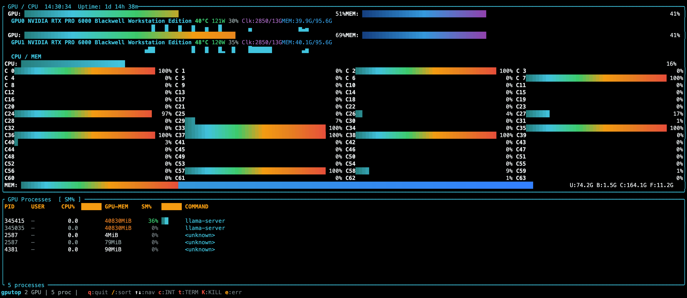

# gputop

A GPU monitoring TUI written in Rust, inspired by `gotop`, `nvidia-smi`, `nvitop`, and `jtop`.



## Installation

### One-liner (recommended)

```bash
curl -fsSL https://raw.githubusercontent.com/jlu-lujing/gputop/main/install.sh | bash
```

### Manual install

Download the binary from [Releases](https://github.com/jlu-lujing/gputop/releases):

```bash
# Download and extract
curl -fsSL https://github.com/jlu-lujing/gputop/releases/latest/download/gputop-x86_64-unknown-linux-gnu.tar.gz \
  | tar xz

# Install
sudo install -Dm755 gputop /usr/local/bin/gputop
```

### Build from source

```bash
cargo install --git https://github.com/jlu-lujing/gputop.git
```

**Requirements:**
- Linux x86_64
- NVIDIA GPU + NVIDIA driver (NVML)

## Features

- ✅ **Smooth RGB gradient bars** — 256-color interpolation, btop-style
- ✅ **Sparkline history** — 90s GPU utilization trend
- ✅ **GPU metrics** — temp, power, clocks, fan speed
- ✅ **Per-process GPU usage** — PID, SM%, GPU memory
- ✅ **Interactive process table** — sort, navigate, kill
- ✅ **CPU overview** — total + per-core utilization bars
- ✅ **Memory breakdown** — used / buffers / cached / free
- ✅ **Multi-GPU support**
- ✅ **Adaptive layout** — auto-adjusts to terminal size

## Keyboard Shortcuts

| Key | Action |
|-----|--------|
| `q` / `Esc` | Quit |
| `/` | Cycle sort: SM% → GPU-MEM → CPU% → PID |
| `↑` / `↓` / `k` / `j` | Navigate processes |
| `c` | SIGINT |
| `t` | SIGTERM |
| `K` | SIGKILL |
| `e` | Clear error |

## License

MIT
